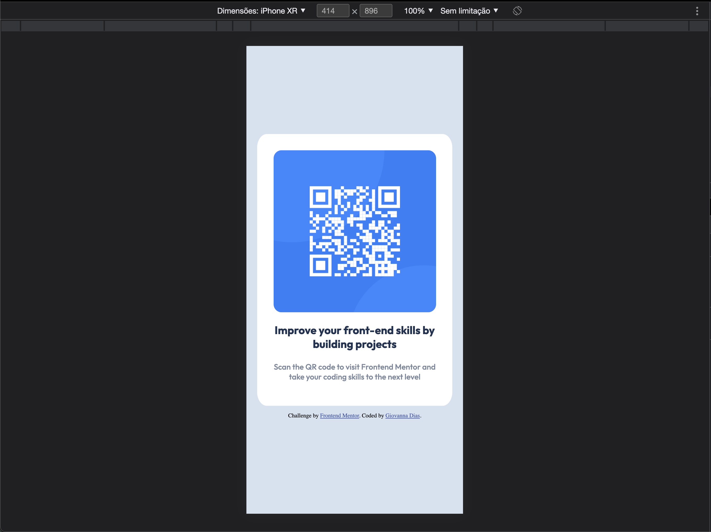

# Frontend Mentor - QR code component solution

This is a solution to the [QR code component challenge on Frontend Mentor](https://www.frontendmentor.io/challenges/qr-code-component-iux_sIO_H). 

## Table of contents

- [Overview](#overview)
  - [Screenshot](#screenshot)
  - [Links](#links)
- [My process](#my-process)
  - [Built with](#built-with)
  - [What I learned](#what-i-learned)
  - [Continued development](#continued-development)
  - [Useful resources](#useful-resources)
- [Author](#author)


____
## Overview
### Screenshots

<br>
Desktop page

> 

<br>
Mobile page

> 


### Links

- Solution URL: [on Netfly](https://zesty-longma-398414.netlify.app/)

___

## My process

### Built with

- Semantic HTML5 markup
- CSS custom properties


### What I learned

As I built this project I learned on how to make a content resizable accordingly to the screen size by using the 'transform' CSS property.
I also learned about the use of the '@media' property and how to define a set of properties to respond to a min and max screen resolution.

To see how you can add code snippets, see below:

```css
@media (min-width: 768px) and (max-width: 1920px) {
  .area {
    display: block;
    position: fixed;
    left: 50%;
    top: 25%;
    transform: translate(-50%, -25%);
    margin: auto;
  }
}
@media (min-width: 375px) and (max-width: 767px) {
  .area {
    display: block;
    position: fixed;
    left: 50%;
    top: 50%;
    transform: translate(-50%, -50%);
    width: 150%;
  }
```

### Continued development

I want to keep focusing on getting the best out of CSS properties and responsive pages.
### Useful resources

- [Using media queries](https://developer.mozilla.org/en-US/docs/Web/CSS/Media_Queries/Using_media_queries) - This helped me to understand how to use @media property. I really liked this resource and will use it going forward.
- [CSS Reference](https://cssreference.io/) - This is an amazing tool which helped me finally understand and visualize how some CSS properties actually behave. I'd recommend it to anyone still learning this concept.

___
## Author

<!-- - Website - [Giovanna Dias](https://www.your-site.com) -->

- Twitter - [@giografia](https://www.twitter.com/giografia)